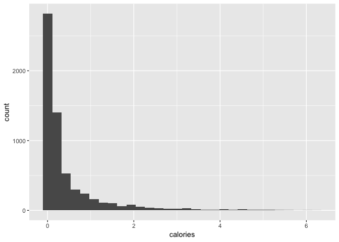

### Loading requires packages


```r
library(tidyverse)
```

## Apple Watch Data

```r
aw_data <- read_csv("https://github.com/walkabilly/HKR6130_MUN/raw/master/data/apple_watch_data.csv")
summary(aw_data)
```

```
##        X1           p_id           device_name       
##  Min.   :   1   Length:6137        Length:6137       
##  1st Qu.:1535   Class :character   Class :character  
##  Median :3069   Mode  :character   Mode  :character  
##  Mean   :3069                                        
##  3rd Qu.:4603                                        
##  Max.   :6137                                        
##    date_time                       heart           calories      
##  Min.   :2018-07-28 02:30:00   Min.   :  0.00   Min.   :0.00000  
##  1st Qu.:2018-07-31 00:57:00   1st Qu.:  0.00   1st Qu.:0.00003  
##  Median :2018-08-01 02:31:00   Median :  0.00   Median :0.14612  
##  Mean   :2018-07-31 21:55:25   Mean   : 13.57   Mean   :0.45021  
##  3rd Qu.:2018-08-02 04:05:00   3rd Qu.:  0.00   3rd Qu.:0.45252  
##  Max.   :2018-08-03 05:39:00   Max.   :124.00   Max.   :6.24054  
##      steps            distance     
##  Min.   : 0.0000   Min.   : 0.000  
##  1st Qu.: 0.0000   1st Qu.: 0.000  
##  Median : 0.4258   Median : 0.309  
##  Mean   :10.1795   Mean   : 8.195  
##  3rd Qu.:13.6088   3rd Qu.:10.422  
##  Max.   :99.5206   Max.   :86.714
```

## Replace the Zero's in the heart, steps, calories, and distance data with _NA_ (missing)

Hint. There is function called `na_if` in `tidyverse`. You can combine it with the pipe operator to turn all zeros in the dataframe to NA. 

```r
aw_data <- aw_data %>%
  na_if(0)
```

Description: The function `na_if` replaces a specific value with _NA_ for a specific column or for an entire dataframe. The only input needed for the function is what value to replace with _NA_. In our case we relace 0 with _NA_. 

## Calculate the mean and standard deviation for heart rate, calories, steps, and distance.

Hint. You can use the `mean` function. Be careful and check the function because we not have _NA_ values and if you try and calculate the mean of nothing you get nothing. Check `?mean` if you are not getting what you expect. 


```r
## Heart Rate
mean(aw_data$heart, na.rm = TRUE)
```

```
## [1] 59.53469
```

```r
sd(aw_data$heart, na.rm = TRUE)
```

```
## [1] 14.79135
```

```r
## calories
mean(aw_data$calories, na.rm = TRUE)
```

```
## [1] 0.6002465
```

```r
sd(aw_data$calories, na.rm = TRUE)
```

```
## [1] 0.8932777
```

```r
## Steps
mean(aw_data$steps, na.rm = TRUE)
```

```
## [1] 19.81331
```

```r
sd(aw_data$steps, na.rm = TRUE)
```

```
## [1] 19.70799
```

```r
mean(aw_data$distance, na.rm = TRUE)
```

```
## [1] 16.04188
```

```r
sd(aw_data$distance, na.rm = TRUE)
```

```
## [1] 16.81104
```

## Create a histogram of the calories column

Hint: 
- Use ggplot. 
- In your description describe in general how you understand ggplot works. 
- Describe with the function `ggplot` does and what the `geom` to create the histogram does. 


```r
histo_calories <- ggplot(aw_data) + 
                    geom_histogram(aes(calories))
plot(histo_calories)
```

<!-- -->

## Create a scatter plot of heart rate on the y axis and time on the x axis

Hint: 
- Use ggplot. 
- What is the difference between the `geom` for creating scatter plots and the `geom` for creating historgrams. 


```r
scatter_heart_steps <- ggplot(aw_data) + 
                    geom_point(aes(y = heart, x = date_time)) 
plot(scatter_heart_steps)
```

<!-- -->


## Create a scatter plot of steps and heart rate on the y axis and time on the x axis on the same figure

Hint: 
- Start with your previous plot and see if you can build on by adding another layer.
- You will need to find a way to change the colour of the points in the scatter plot because the default will have a bunch of black points that won't make sense. 
- What is the difference between the `geom` for creating scatter plots and the `geom` for creating historgrams. 


```r
scatter_heart_steps <- ggplot(aw_data) + 
                    geom_point(aes(y = steps, x = date_time, colour = "Steps")) + 
                    geom_point(aes(y = heart, x = date_time, colour = "Heart")) 
plot(scatter_heart_steps)
```

<!-- -->


